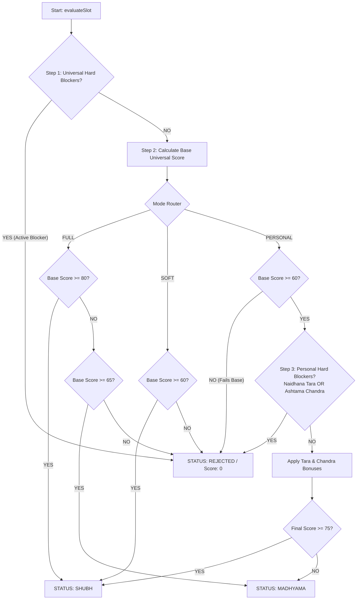

what is personal mode

The confusion happens when **Personal Mode** is treated as a third, independent "strictness slider" alongside Full and Soft.

In classical *Muhurta* (*Muhurta Chintamani*, *Kalaprakashika*), personal factors like **Tara Bala** (Lunar Mansion strength relative to birth star) and **Chandra Bala** (Lunar Transit strength relative to birth sign) are **not an isolated mode—they are a personal compatibility layer built on top of universal time.**

---

### The Proper Definition of the 3 Modes

To fix your engine architecture cleanly, define the relationship between the three modes as follows:

```
[ Tier 1: Universal Time (Gochara) ] ───────► FULL MODE (Strict Universal)
                                   └───────► SOFT MODE (Relaxed Universal)

[ Tier 2: Individual Compatibility ] ──────► PERSONAL MODE = (Base Universal Slot) 
                                                             + Tara Bala 
                                                             + Chandra Bala

```

---

### 1. Full Mode (Universal Strict)

* **Definition:** **The Ideal Cosmic Window (Impersonal).**
* **Target Audience:** Public releases, commercial announcements, multi-stakeholder corporate events where individual birth details are either unknown or secondary.
* **Evaluation Logic:**
* **Hard Blockers:** Strict Zero-Tolerance (Bhadra, Asta Guru/Shukra, Rikta Tithis, Vyatipata, Yama Ghanta, etc.).
* **Base Scoring Threshold:** High (e.g., Score $\ge 80 / 100$).
* **Personal Factors:** **0% weight.** Completely ignored.


---

### 2. Soft Mode (Universal Relaxed)

* **Definition:** **The Pragmatic Window (Impersonal).**
* **Target Audience:** Time-sensitive real-world situations where waiting for a "Perfect Full Muhurta" is impossible (e.g., tight medical deadlines, strict tax submission dates, urgent travel).
* **Evaluation Logic:**
* **Hard Blockers:** Absolute Hard Blockers remain active (Bhadra in Earth, Asta for Samskaras), but minor daily afflictions (like *Dagdha Yoga* or minor Tithi flaws) are permitted or offset by *Abhijit Muhurta*.
* **Base Scoring Threshold:** Moderate (e.g., Score $\ge 60 / 100$).
* **Personal Factors:** **0% weight.** Completely ignored.


---

### 3. Personal Mode (Individual Match)

* **Definition:** **Universal Window Tailored to the Individual's Horoscope.**
* **Target Audience:** Sole-actor or primary-stakeholder activities (e.g., personal housewarming, starting a specific treatment, individual property deed signing, personal investments).
* **Formula:**

$$\text{Personal Eligibility} = (\text{Base Universal Qualification}) \text{ AND } (\text{Tara Bala Pass}) \text{ AND } (\text{Chandra Bala Pass})$$


#### How Personal Mode MUST Evaluate (The Two Options)

Depending on your product requirements, Personal Mode should operate in one of two clear ways:

#### Option A: Strict Personal (Recommended)

$$\text{Personal Mode} = \mathbf{FULL\ Mode\ Slot} + \text{Tara Bala} + \text{Chandra Bala}$$

* A slot **must first qualify as a valid Universal Full slot**.
* If it passes, the engine applies Tara Bala and Chandra Bala:
* **Good Tara / Chandra Bala** $\rightarrow$ Upgrades slot score to `EXCELLENT_PERSONAL`.
* **Bad Tara (Janma/Vadha/Pratyak) or 8th House Moon (Ashtama Chandra)** $\rightarrow$ **DISQUALIFIES** even a globally perfect date!


#### Option B: Standard Personal

$$\text{Personal Mode} = \mathbf{SOFT\ Mode\ Slot} + \text{Tara Bala} + \text{Chandra Bala}$$

* Allows a slot that qualified under **Soft Mode** to be elevated to **Shubh** if the individual has an exceptionally strong *Tara Bala* (e.g., *Sadhana* or *Mitra Tara*) or favorable *Chandra Bala* (1st, 3rd, 6th, 7th, 10th, 11th houses).
* **Rule:** An unfavorable personal transit (*Ashtama Chandra* or *Naidhana Tara*) **must still reject the slot**, regardless of how soft the base rules are.

---

### Summary Rules Table for Engine Logic

| Dimension | Full Mode | Soft Mode | Personal Mode |
| --- | --- | --- | --- |
| **Universal Hard Blockers** | Strict | Strict | Strict (Inherited from Base) |
| **Universal Score Cutoff** | $\ge 80$ | $\ge 60$ | Inherits Base Cutoff ($\ge 60$ or $\ge 80$) |
| **Tara Bala Active?** | ❌ No | ❌ No | **YES** (Must avoid 3rd, 5th, 7th stars) |
| **Chandra Bala Active?** | ❌ No | ❌ No | **YES** (Must avoid 4th, 8th, 12th houses) |
| **Output Relationship** | Subset of Soft Mode | Parent set for Personal Mode | **Strict Subset of Soft or Full Mode** |

---

### Python Flowchart Implementation (see node implementation as well below)

```python
def evaluate_slot_mode(slot_data, activity_config, mode="FULL", user_natal=None):
    # STEP 1: Universal Base Evaluation (Always Happens First)
    universal_result = evaluate_universal_tier(slot_data, activity_config)
    
    # If universal hard blockers fail, ALL modes return REJECTED immediately
    if universal_result["is_blocked"]:
        return {"status": "REJECTED", "score": 0, "reason": universal_result["blockers"]}

    # STEP 2: Mode Branching
    base_score = universal_result["score"]

    if mode == "FULL":
        status = "SHUBH" if base_score >= 80 else ("MADHYAMA" if base_score >= 65 else "REJECTED")
        return {"status": status, "score": base_score}

    elif mode == "SOFT":
        status = "SHUBH" if base_score >= 60 else "REJECTED"
        return {"status": status, "score": base_score}

    elif mode == "PERSONAL":
        # Personal mode MUST have natal details provided
        if not user_natal or not user_natal.get("birth_star"):
            raise ValueError("Birth star required for PERSONAL mode evaluation.")

        # Require slot to pass at least SOFT base criteria before checking natal fit
        if base_score < 60:
            return {"status": "REJECTED", "score": base_score, "reason": ["Fails base universal threshold"]}

        # Compute Personal Compatibility
        tara_bala = calculate_tara_bala(slot_data.nakshatra, user_natal["birth_star"])
        chandra_bala = calculate_chandra_bala(slot_data.moon_rashi, user_natal["birth_rashi"])

        # Severe Personal Hard Blockers
        if tara_bala["is_severe_malefic"] or chandra_bala["is_ashtama_chandra"]:
            return {
                "status": "REJECTED", 
                "score": 0, 
                "reason": ["Personal Affliction: " + (tara_bala["name"] if tara_bala["is_severe_malefic"] else "Ashtama Chandra")]
            }

        # Modify Base Score with Personal Bonuses/Penalties
        personal_score = base_score + tara_bala["bonus_points"] + chandra_bala["bonus_points"]
        status = "SHUBH" if personal_score >= 75 else "MADHYAMA"
        
        return {"status": status, "score": personal_score, "personal_metrics": {"tara": tara_bala, "chandra": chandra_bala}}

```

Applying this structure ensures that **Personal Mode can never resurrect a bad day**, but instead acts as the final personal compatibility filter on universally viable dates.

Here is a complete, production-ready **Node.js / TypeScript execution flow and decision pipeline** for your agents.

This implementation enforces strict **early-exit guard clauses** for Universal Hard Blockers before proceeding to scoring, and strictly subordinates **Personal Mode** to the universal base evaluation.

---

### 1. Architectural Flowchart (Mermaid)

Pass this diagram to your agent to visualize the strict execution hierarchy:



---

### 2. Complete Node.js / TypeScript Implementation

Your agents can drop this modular code directly into your engine:

```typescript
// ============================================================================
// TYPES & INTERFACES
// ============================================================================

export type EvaluationMode = 'FULL' | 'SOFT' | 'PERSONAL';
export type SlotStatus = 'SHUBH' | 'MADHYAMA' | 'REJECTED';

export interface UserNatalData {
  birthNakshatraIndex: number; // 1 to 27
  birthRashiIndex: number;     // 1 to 12
}

export interface SlotData {
  timestamp: string;
  tithiNumber: number;        // 1 to 30
  nakshatraIndex: number;     // 1 to 27
  moonRashiIndex: number;      // 1 to 12
  isBhadraInMrityuLoka: boolean;
  isCombustJupiter: boolean;   // Asta Guru
  isCombustVenus: boolean;     // Asta Shukra
  isRiktaTithi: boolean;
  isAbhijitMuhurta: boolean;
}

export interface ActivityConfig {
  activityId: string;
  requiresUpwardFacing: boolean;
  forbidsAsta: boolean;
  allowRikta: boolean;
}

export interface EvaluationResult {
  status: SlotStatus;
  score: number;
  mode: EvaluationMode;
  reasons: string[];
  personalMetrics?: {
    taraName: string;
    taraScoreBonus: number;
    chandraHouse: number;
    chandraScoreBonus: number;
  };
}

// ============================================================================
// TARA & CHANDRA BALA HELPER FUNCTIONS
// ============================================================================

const TARA_NAMES = [
  "Janma", "Sampat", "Vipat", "Kshema", "Pratyak", 
  "Sadhana", "Naidhana", "Mitra", "Parama Mitra"
];

function calculateTaraBala(transitNakshatra: number, birthNakshatra: number) {
  // Count from birth star to transit star inclusive
  let count = (transitNakshatra - birthNakshatra + 1);
  if (count <= 0) count += 27;
  
  const position = ((count - 1) % 9) + 1; // 1 to 9
  const taraName = TARA_NAMES[position - 1];

  // 3rd (Vipat), 5th (Pratyak), 7th (Naidhana) are inauspicious
  const isSevereMalefic = (position === 7); // Naidhana / Vadha
  const isMinorMalefic = (position === 3 || position === 5);

  let bonus = 0;
  if (position === 2 || position === 4 || position === 6 || position === 8 || position === 9) {
    bonus = 15; // Auspicious Tara
  } else if (isMinorMalefic) {
    bonus = -15;
  }

  return { position, taraName, isSevereMalefic, bonus };
}

function calculateChandraBala(transitRashi: number, birthRashi: number) {
  // Calculate house position of Moon from Birth Sign
  let house = (transitRashi - birthRashi + 1);
  if (house <= 0) house += 12;

  // 8th House (Ashtama Chandra) is a severe personal blocker
  const isAshtamaChandra = (house === 8);
  
  // 4th, 12th houses are also unfavorable
  const isUnfavorable = (house === 4 || house === 12);

  let bonus = 0;
  if ([1, 3, 6, 7, 10, 11].includes(house)) {
    bonus = 15; // Favorable Moon transit
  } else if (isUnfavorable) {
    bonus = -10;
  }

  return { house, isAshtamaChandra, bonus };
}

// ============================================================================
// CORE EVALUATION ENGINE
// ============================================================================

export function evaluateSlot(
  slot: SlotData,
  config: ActivityConfig,
  mode: EvaluationMode = 'FULL',
  userNatal?: UserNatalData
): EvaluationResult {
  const reasons: string[] = [];

  // --------------------------------------------------------------------------
  // TIER 1: UNIVERSAL HARD BLOCKERS (EARLY EXIT GUARD)
  // --------------------------------------------------------------------------
  if (slot.isBhadraInMrityuLoka) {
    reasons.push("HARD_BLOCKER: Active Bhadra in Mrityu Loka (Earth)");
  }

  if (config.forbidsAsta && (slot.isCombustJupiter || slot.isCombustVenus)) {
    reasons.push("HARD_BLOCKER: Combustion of Jupiter or Venus (Asta)");
  }

  if (!config.allowRikta && slot.isRiktaTithi) {
    reasons.push("HARD_BLOCKER: Forbidden Rikta Tithi (4, 9, 14)");
  }

  // FAIL FAST: If any universal hard blocker is active, abort immediately across ALL modes
  if (reasons.length > 0) {
    return { status: 'REJECTED', score: 0, mode, reasons };
  }

  // --------------------------------------------------------------------------
  // TIER 2: UNIVERSAL BASE SCORING
  // --------------------------------------------------------------------------
  let baseScore = 70; // Baseline starting score for non-afflicted slot

  if (slot.isAbhijitMuhurta) {
    baseScore += 15; // Abhijit bonus neutralizes minor temporal flaws
  }

  // Cap base score between 0 and 100
  baseScore = Math.min(100, Math.max(0, baseScore));

  // --------------------------------------------------------------------------
  // TIER 3: MODE ROUTING & PERSONAL LAYER
  // --------------------------------------------------------------------------
  
  // A. FULL MODE (Strict Impersonal)
  if (mode === 'FULL') {
    if (baseScore >= 80) {
      return { status: 'SHUBH', score: baseScore, mode, reasons: ["Passes strict universal criteria"] };
    } else if (baseScore >= 65) {
      return { status: 'MADHYAMA', score: baseScore, mode, reasons: ["Acceptable universal score"] };
    } else {
      return { status: 'REJECTED', score: baseScore, mode, reasons: ["Fails strict universal threshold"] };
    }
  }

  // B. SOFT MODE (Relaxed Impersonal)
  if (mode === 'SOFT') {
    if (baseScore >= 60) {
      return { status: 'SHUBH', score: baseScore, mode, reasons: ["Passes relaxed universal criteria"] };
    } else {
      return { status: 'REJECTED', score: baseScore, mode, reasons: ["Fails relaxed universal threshold"] };
    }
  }

  // C. PERSONAL MODE (Individual Horoscope Layer)
  if (mode === 'PERSONAL') {
    if (!userNatal || !userNatal.birthNakshatraIndex || !userNatal.birthRashiIndex) {
      throw new Error("PERSONAL mode requires valid userNatal data (birthNakshatraIndex and birthRashiIndex).");
    }

    // Guard: Slot MUST first pass the minimum base universal threshold
    if (baseScore < 60) {
      return { 
        status: 'REJECTED', 
        score: baseScore, 
        mode, 
        reasons: ["Fails base universal qualification before applying personal filters"] 
      };
    }

    // Evaluate Personal Compatibility
    const tara = calculateTaraBala(slot.nakshatraIndex, userNatal.birthNakshatraIndex);
    const chandra = calculateChandraBala(slot.moonRashiIndex, userNatal.birthRashiIndex);

    // Personal Hard Blockers
    if (tara.isSevereMalefic) {
      reasons.push(`PERSONAL_BLOCKER: Incompatible Naidhana (7th) Tara (${tara.taraName})`);
    }
    if (chandra.isAshtamaChandra) {
      reasons.push(`PERSONAL_BLOCKER: Ashtama Chandra (Moon in 8th house from natal sign)`);
    }

    // Reject if personal hard blocker triggered
    if (tara.isSevereMalefic || chandra.isAshtamaChandra) {
      return { status: 'REJECTED', score: 0, mode, reasons };
    }

    // Apply Personal Score Modifiers
    const finalPersonalScore = Math.min(100, Math.max(0, baseScore + tara.bonus + chandra.bonus));
    const status: SlotStatus = finalPersonalScore >= 75 ? 'SHUBH' : 'MADHYAMA';

    return {
      status,
      score: finalPersonalScore,
      mode,
      reasons: reasons.concat([`Tara: ${tara.taraName}`, `Chandra House: ${chandra.house}`]),
      personalMetrics: {
        taraName: tara.taraName,
        taraScoreBonus: tara.bonus,
        chandraHouse: chandra.house,
        chandraScoreBonus: chandra.bonus
      }
    };
  }

  return { status: 'REJECTED', score: 0, mode, reasons: ["Invalid mode specified"] };
}

```

---

### 3. Key Rules Enforced by This Code

1. **Early Exit Guard (Lines 111–114):** Hard blockers (`Bhadra`, `Asta Guru/Shukra`, `Rikta Tithi`) evaluate immediately and return `REJECTED` with `score: 0`. No bonuses, *Abhijit Muhurta*, or *Tara Bala* can bypass this block.
2. **Strict Hierarchy Invariant:** `baseScore < 60` causes `PERSONAL` mode to fail early. Personal mode **cannot resurrect a universally rejected slot**.
3. **Deterministic Subset Alignment:**

$$\text{Count}(\text{FULL}) \le \text{Count}(\text{SOFT}) \quad \text{AND} \quad \text{Count}(\text{PERSONAL}) \le \text{Count}(\text{SOFT})$$